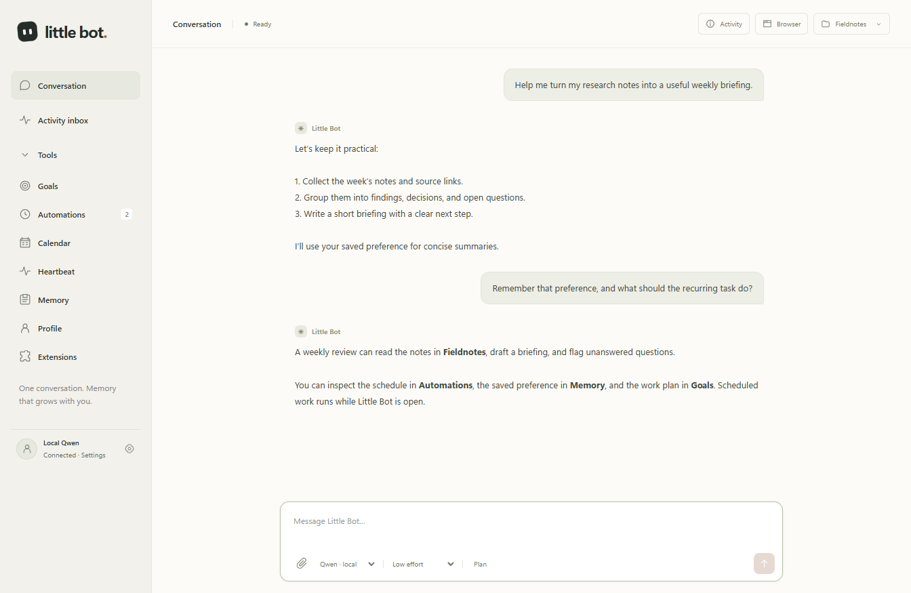
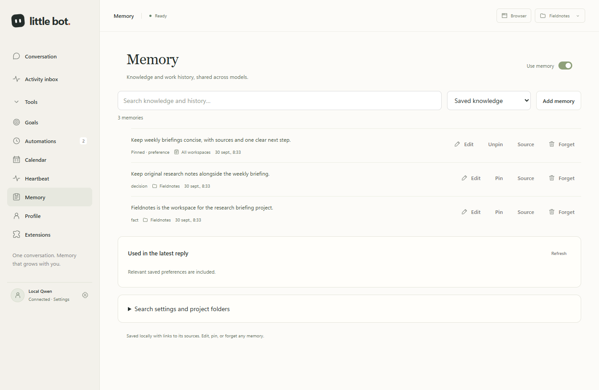
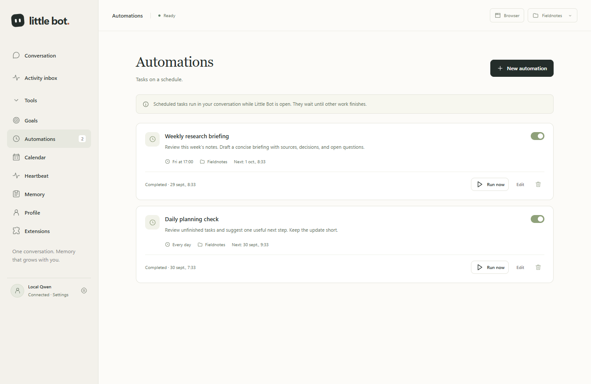

# Little Bot

A Windows personal assistant with one continuous conversation, durable local memory, files, terminal work, web browsing, and proactive tasks. Electron, plain JavaScript, and a pinned Codex tool runtime.

## A quick look

Screenshots below use the real application renderer with fictional demo data. No personal chats, profiles, credentials, or model requests are involved.

### One conversation, with tools when you need them

Keep a continuous timeline, attach files and images, choose reasoning effort, and expand tool activity without filling the chat with controls. Right-click a completed answer to challenge it.



### Memory you can inspect and edit

Search saved knowledge, inspect sources, pin preferences, and forget obsolete information. A bundled CPU embedding model adds offline semantic search; original conversations remain searchable after context compaction.



### Useful recurring work

Run scheduled prompts in the same conversation, using intervals or selected days and local times. Goals add a persistent plan and verification evidence; Heartbeat checks for meaningful updates while the app is open.



## Start

1. Start your existing Qwen launcher.
2. Build from source with the Development commands below, then choose a generated Windows build:
   - **Installer:** run `dist/0.9.2/Little-Bot-0.9.2-Setup.exe`. It installs per-user under LocalAppData, adds a Start Menu shortcut, and registers an uninstaller in Apps & Features.
   - **Portable:** unzip `dist/0.9.2/Little-Bot-0.9.2-portable.zip` and run `Little Bot.exe`. Keep the extracted folder together.
   - **Development package:** open **Launch Little Bot.cmd** after `npm run package`.
3. Choose a working folder and send a message.

**Local Qwen** is the default at `http://127.0.0.1:8080/v1`. Settings lets you change its address/model and check the connection. **Codex** is optional, using ChatGPT sign-in or an OpenAI API key. No cloud fallback occurs when the local model is offline.

**Settings → Connection** also shows read-only provider usage for Codex or transient whole-turn performance for the selected local model. Codex values come from the pinned app-server rate-limit response; local output rates use engine-reported tokens and exclude tool turns from the rolling average. The panel does not estimate prices or change goal budgets. See [USAGE.md](USAGE.md).

**Strata reasoning** offers None, Low, Medium, and High beside the model picker. Other local servers use Thinking On/Off; Codex keeps its effort selector. Changes apply to the next run, after current work finishes.

Tool calls appear in expandable groups, including progress messages between calls. Running and failed counts stay visible when collapsed.

Click **Thinking…** in a reply to expand the reasoning as it streams. The completed **Thoughts** remains available in that conversation. Qwen3.6 sampling follows the thinking mode, with output space reserved for the answer.

Little Bot can ask a question during a normal chat, with optional choices or your own answer. Answer to continue, or skip. Autonomous goals save questions on their goal card; answering continues the goal within its existing access and remaining budget.

The Conversation view is one persistent timeline. Change its working folder, model, or connection between turns; Little Bot opens a fresh engine context when needed and carries forward recent conversation plus relevant memory. Autonomous tasks keep their saved execution settings. See [CONNECTIONS.md](CONNECTIONS.md).

## Files and images

Attach with the paperclip, drop files, or paste an image. Qwen can inspect photos. PDF, DOCX, and text files supply locally extracted text; scanned PDFs need OCR, which is not included. Other formats remain accessible as files.

The agent can return documents, screenshots, and existing images as attachments with preview/save controls. This version does not add an image-generation model.

Limits: eight files per message, 20 MiB each, 50 MiB total. See [ATTACHMENTS.md](ATTACHMENTS.md) for supported formats and extraction limits.

Execute mode can perform file and terminal work with the app’s local permissions; Plan mode uses read-only execution. Choose a suitable working folder. This is a personal, experimental assistant with powerful local tools.

## Browser and web services

**Browser** opens Vercel agent-browser with a separate profile for browsing, forms, tabs, and screenshots. Sign in there manually when needed. It uses Chrome or Edge; Settings offers browser installation when neither is available.

Optional **Firecrawl** and **Brave Search** keys go in **Settings → Web services** and are stored encrypted. Browser control needs neither key. Service queries/URLs go to that service and may consume credits. Direct chats can browse; goals with network permission can search and scrape.

## Personal assistance

- **Profile:** edit USER.md for your facts/preferences and SOUL.md for the assistant's voice. Changes apply on the next request.
- **Memory:** SQLite stores preferences, project facts, decisions, discoveries, work episodes, and searchable source history. Automatic learning runs between tasks; explicit `memory_save` and `memory_forget` tools apply changes immediately. The Memory panel searches, edits, pins, forgets, and shows sources and the context used in the latest reply. Bundled quantized BGE-base adds offline CPU semantic search with no server setup; full-text search remains available. Tool traces are archived separately from recall, and the Memory panel opens on saved knowledge. See [MEMORY.md](MEMORY.md).
- **Independent Check:** optional same-model anti-sycophancy review with Off, Selective, and Always modes plus a manual **Challenge this answer** action in the right-click menu on completed replies. It runs sequentially without tools and keeps the completed draft if review fails or is stopped. See [INDEPENDENT-CHECK.md](INDEPENDENT-CHECK.md).
- **Goals:** define an objective, checks, permissions, and budget. Every goal keeps a versioned one-active-step plan plus bounded assumptions, observations, decisions, and verification evidence that survive restart and chat compaction. Review undo records restored file evidence. See [GOALS.md](GOALS.md) and [LEDGER.md](LEDGER.md).
- **Automations and standing intents:** repeat prompts by interval or exact PC-local time, or connect foreground events to an existing authorized goal or automation. Standing intents use one bounded in-process queue and stop with the app. See [EVENTS.md](EVENTS.md).
- **Calendar:** a local Little Bot calendar with all-day or timed events. The UI and agent can create, edit, delete, and list events using the PC's local clock. External calendar sync is not included.
- **Activity inbox:** a dedicated sidebar tab for Heartbeat and goal updates, with unread/error and source filters, read controls, and topic feedback.
- **Heartbeat:** a bounded checklist, active hours, and run limits. Useful, Later, and Don't suggest this control attention. Goals and heartbeat share the notification budget.
- **Extensions:** skills, plugins, and MCP connections. Four included skills cover app operations, web work, research briefs, and meeting preparation. Scheduling questions automatically include the enabled `little-bot` guide with heartbeat setup, routine examples, and troubleshooting. You can also invoke it with `$little-bot`.

Autonomous work runs while the app is open and the PC is awake. **Pause all** pauses it across restarts. There is no tray worker, startup service, or wake-from-sleep mechanism. See [GOALS.md](GOALS.md), [EXTENSIONS.md](EXTENSIONS.md), and [NEXT.md](NEXT.md).

Automations support repeating intervals and exact PC-local clock times on selected weekdays. They do not parse cron expressions or provide one-time timers. If Little Bot is closed when work becomes due, that occurrence is skipped and the next future occurrence is selected on reopening. If the app remains open but the single execution lane is busy, due work waits for that lane. If the PC sleeps while the process remains open, a due item may make one attempt after the process resumes. Standing intents follow the same foreground-only lifecycle and collect no events while the app is closed. The agent can create and enable automation schedules through chat, update them, or pause/resume them; heartbeat and standing-intent configuration use their panels. See [EVENTS.md](EVENTS.md) and the [built-in operating guide](resources/skills/little-bot/SKILL.md).

Settings also controls automatic compaction: **20–95%**, default **80%**; **0** retains only native limits. **Compact now** summarizes older context while keeping the visible transcript. See [COMPACTION.md](COMPACTION.md).

Recall and automatic learning require Memory on. Knowledge is shared across models and connections, with current-project relevance and cross-folder search. Link moved folders under Memory settings to retain project continuity. Corrections supersede earlier facts; forgotten memories are suppressed from automatic relearning. The model can use `memory_search` and `session_read` to retrieve older details after native context compaction. This searches Little Bot history, not other apps.

Bundled skill updates preserve user edits, disabled state, IDs, and deletions. [Skill sources and licenses](resources/skills/SOURCES.md).

## Strata cache rotation — requires PR #175

Little Bot’s cache isolation is tied to **[Strata PR #175: independent conversation cache slots](https://github.com/Niko1221/Strata/pull/175)**. The app sends slot IDs; the patched Strata engine and Python server implement the actual save/restore. An ordinary upstream build must not be assumed to include this feature until that PR is merged and released.

| Slot | Work |
| --- | --- |
| 0 | Foreground conversation and its scheduled automations |
| 1 | Memory extraction |
| 2 | Goals and heartbeat |
| 3 | Independent answer checks |

One model runs requests sequentially. Inactive KV data **and recurrent/checkpoint payloads** go to temporary disk files, freeing their RAM buffers while the active slot stays in memory. This is not parallel generation, permanent chat storage, or a second model copy.

Cache reuse requires a matching prompt prefix. Compaction, a changed prefix, a restart, or another client using the same slot can require a cold read. Cache slots are shared by the server: **run diagnostic inference against a separate test server**, never alongside your real conversation.

A local Windows / RTX 4070 Ti / NVMe test measured about **866 MiB less additional private-memory growth** across populated slots and **0.44–0.94 seconds total** for restored-slot switches. These are one-workload observations, not universal performance promises. Multi-GPU sessions currently support only slot 0.

See [the Strata integration guide](integrations/strata/README.md) for the tested revision, patch, build instructions, and validation limits.

## Local data

Data lives in `%APPDATA%/Little Bot/data`: the saved conversation, a local SQLite memory database, profile, attachments, browser state, service keys, and isolated engine state. The existing conversation state uses Windows DPAPI through Electron safeStorage; the new memory database is an ordinary local SQLite file. The app keeps one conversation timeline; legacy fact and episode arrays are not imported into the new database. Attachments, profile Markdown files, calendar, automation, and standing-intent metadata, and other local configuration remain ordinary local files. The app does not change your existing Codex or OpenClaw configuration. Streaming replies checkpoint about every two seconds and save immediately on completion or interruption; an abrupt power loss can lose the most recent unsaved text.

Prompts and attachments go to the selected model connection: local Qwen stays on this computer; Codex sends them to its provider. Web services and MCP tools have their own destinations. Provider usage and local performance samples are transient and are not added to saved chats or Memory. The renderer has no Node access or remote scripts. This is an unsigned personal build.

## Development

Node.js 24 or newer:

```powershell
npm install
node node_modules/electron/install.js
npm run check:syntax
npm test
npm run test:electron
npm start
npm run package
npm run package:portable
```

`npm run ci` runs the syntax, Node, and Electron checks used by the main CI workflow. The Windows distribution workflow separately verifies packaging, installation, and removal.

On Windows, `npm run package` produces the unpacked app folder, a portable ZIP, and a per-user Setup EXE. `npm run package:portable` skips installer creation and builds only the unpacked folder plus portable ZIP. The installer is a self-extracting Windows bootstrapper built with the .NET Framework compiler, needs no administrator rights, and can be removed from Apps & Features.

Pinned dependencies: Codex 0.157.1, agent-browser 0.38.1, Mammoth 1.12.3, unpdf 1.8.1, Electron 44.4.5, ONNX Runtime 1.30.0, and Hugging Face Tokenizers 0.2.0. Embedding assets are fetched and verified at build time, then bundled for offline use; the installed app downloads no models.

For focused checks and remaining limitations, see [VALIDATION.md](VALIDATION.md). Smoke runs require a fresh isolated `LITTLE_BOT_DATA_DIR`.

References: [Codex app-server](https://learn.chatgpt.com/docs/app-server), [agent-browser](https://agent-browser.dev/), [Firecrawl](https://docs.firecrawl.dev/), [Electron security](https://www.electronjs.org/docs/latest/tutorial/security).

To regenerate the anonymous screenshots: `npx electron scripts/readme-screenshots.cjs`. This uses a temporary demo profile and never connects to your model.
