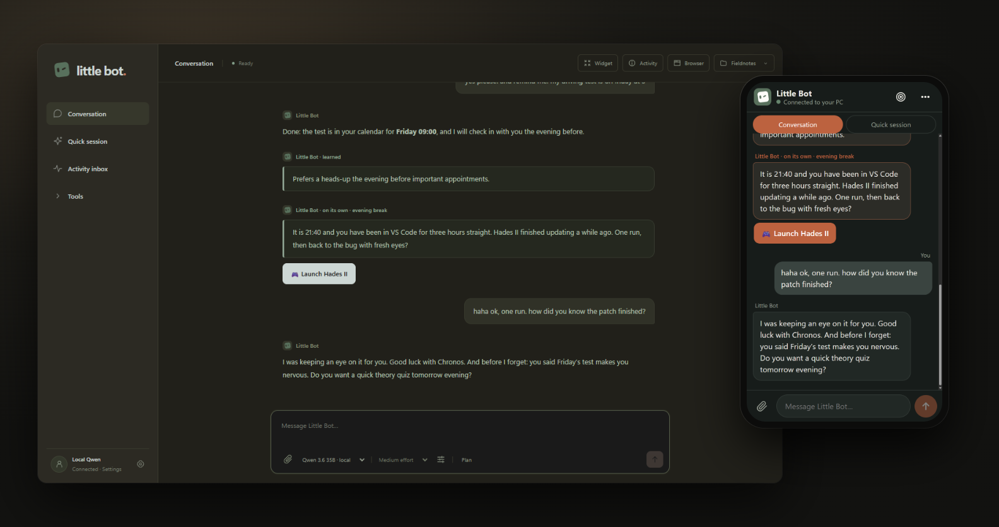
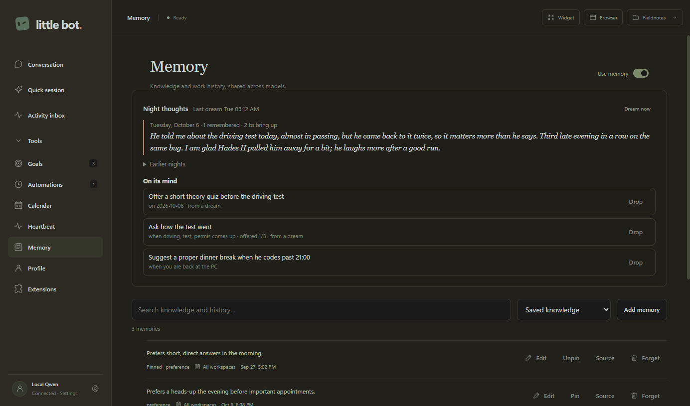
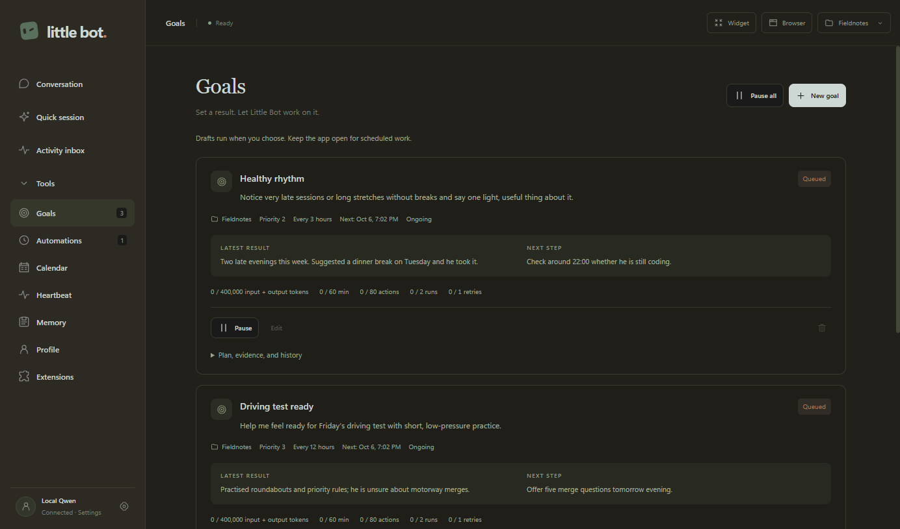
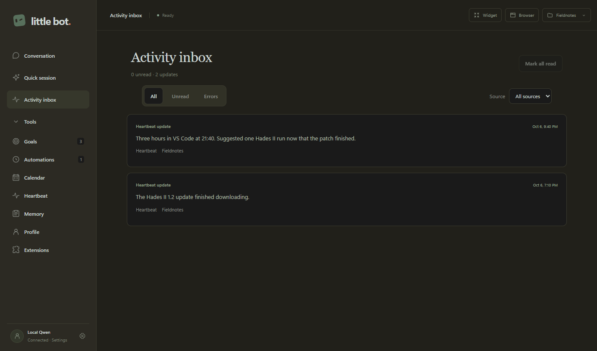
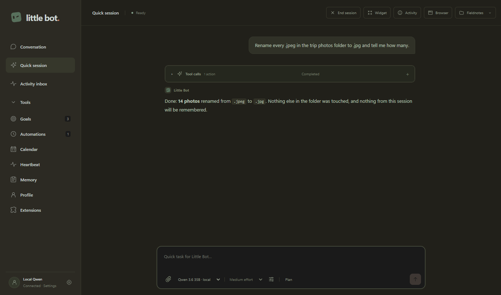
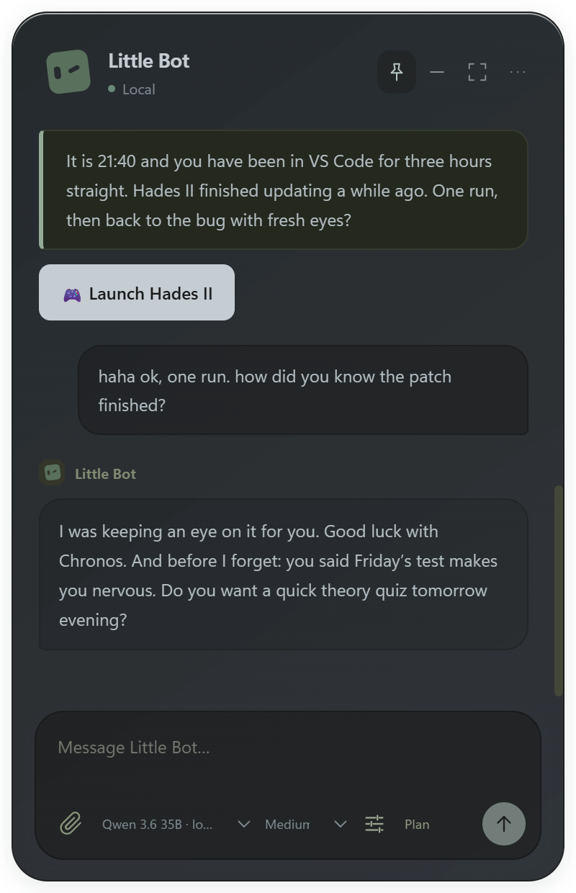
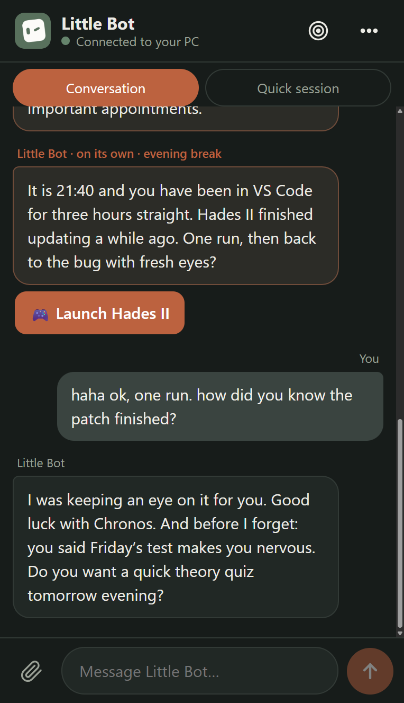
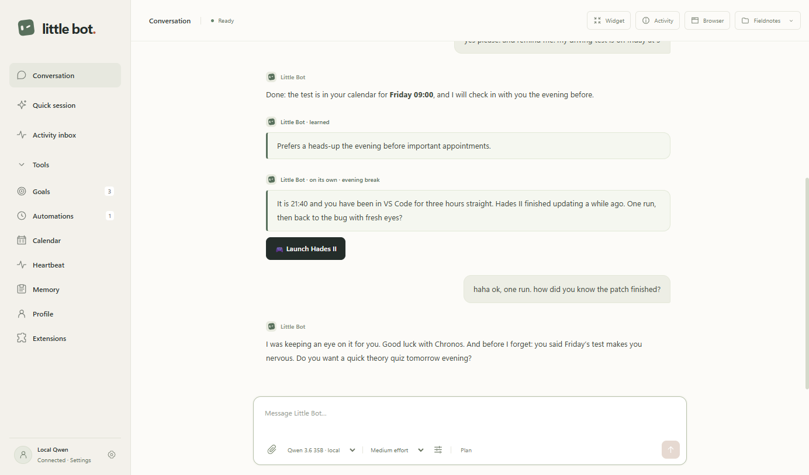
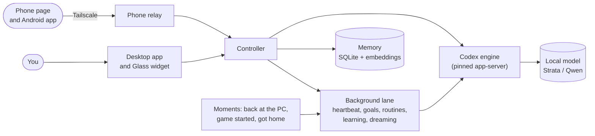

<h1 align="center">
  <br>
  Little Bot
</h1>

<p align="center">
  <b>A local-first AI companion for Windows.</b><br>
  It remembers you, notices what is going on, dreams over your day at night,<br>
  and speaks up on its own: all on your own GPU.
</p>

<p align="center">
  
  
  
  
</p>

<p align="center"></p>

Most assistants wait for you to type. Little Bot keeps one continuous conversation with you, learns what matters, and has a life between your messages: it checks in at good moments, follows up on things you mentioned, works on goals you gave it, and reflects on your days overnight. It runs on a local model (Qwen through [Strata](integrations/strata/README.md) by default), so your conversations stay on your PC.

## Why it feels alive

**🫀 It speaks up on its own.** The heartbeat keeps its own agenda and chooses when to look again. It also wakes on real moments: you come back to the PC, start a game, have been in the same app for hours, get home, or just finished a conversation. Active hours, daily limits and *Later / don't suggest this* keep it pleasant.

**🌙 It dreams.** Once a night it looks back over the last days, tidies what it remembers (only from your own words, never its own claims), writes a short diary entry in its own voice, and decides what it wants to bring up. You can read every night on the Memory page.

**💭 It remembers to ask.** Intentions are prospective memory: *ask how the exam went*, *when the patch comes up, mention the DLC*, *on Friday, check in*. They trigger on the next chat, a topic, a date or a moment, and are budgeted (once a day, three times, then they expire) so it never nags.

**🎯 It works toward goals with you.** Ongoing goals review fresh evidence from your chat, calendar and project files, keep a plan with verifiable progress, and either talk to you or work silently.

**📱 It is in your pocket.** Pair your phone and use the same conversation anywhere over Tailscale, with notifications. The Android companion app adds location (home/away), alarms, timers and "ring my phone".

<table>
  <tr>
    <td width="50%"><br><sub><b>Night thoughts.</b> Last night's diary and what is on its mind.</sub></td>
    <td width="50%"><br><sub><b>Goals.</b> Ongoing work with a plan, evidence and a budget.</sub></td>
  </tr>
  <tr>
    <td><br><sub><b>Activity inbox.</b> Everything it did or noticed on its own.</sub></td>
    <td><br><sub><b>Quick session.</b> One-off tasks with no memory, goals or follow-ups.</sub></td>
  </tr>
</table>

<p align="center">
  
  &nbsp;&nbsp;&nbsp;
  
</p>
<p align="center"><sub>The <b>Glass widget</b> (Ctrl+Shift+M) and the <b>phone page</b>: the same conversation, wherever you are.</sub></p>

## What it can do

| | |
|---|---|
| **Work on your PC** | Files and terminal in a working folder (*Execute*), or read-only *Plan* mode. Attach images, PDFs, Word and text files; it can hand files back. |
| **Use the web** | A built-in browser panel it drives while you watch (logins persist), plus optional Firecrawl or Brave Search keys for search and scraping. |
| **Use your apps** | Windows UI Automation: list windows, read controls, click, type and select in ordinary desktop apps. |
| **Know your life** | A local calendar, your Steam library (with one-click launch offers), web pages it watches for changes, and opt-in awareness of the app you are using. |
| **Remember** | Facts, preferences and decisions in a local SQLite memory with offline semantic search (bundled BGE embeddings). Inspect, edit, pin or forget anything, with sources. |
| **Stay honest** | Optional *Independent Check* reviews answers for sycophancy, and you can right-click any reply to challenge it. |
| **Grow** | Skills, plugins and MCP servers; recurring routines; a profile in `USER.md` and a personality in `SOUL.md`. |

<p align="center"></p>
<p align="center"><sub>Light, dark or follow Windows.</sub></p>

## Runs on your machine

- **Local model first.** Any OpenAI-compatible local server works; Little Bot is tuned for [Strata](integrations/strata/README.md) with Qwen models, including reasoning levels and sampling controls (temperature, top-p, top-k, max tokens, seed). [Codex](CONNECTIONS.md) (ChatGPT sign-in or an OpenAI API key) is optional. There is no silent cloud fallback.
- **Your data stays local.** Conversations, the dream diary and intentions are encrypted with Windows DPAPI. Memory is a local SQLite database, backed up daily with one-click restore. The phone relay only answers paired devices, ideally over Tailscale HTTPS.
- **One lane at a time.** Your conversation always comes first; the heartbeat, goals, routines, memory learning and dreaming share a single background lane and step aside when you write.



## Get started

You need Windows 10 or 11 (x64), [Node.js 24](https://nodejs.org) to build, and either a local OpenAI-compatible server (Strata at `http://127.0.0.1:8080/v1` by default) or a Codex sign-in.

```powershell
git clone https://github.com/b7216309-jpg/little-bot.git
cd little-bot
npm install
node node_modules/electron/install.js
npm run package
```

Then run `dist/<version>/Little-Bot-<version>-Setup.exe`. It installs per user, needs no administrator rights and adds an uninstaller to Apps & Features. A portable ZIP is built next to it, and `npm start` runs from source.

On first launch: check the connection in **Settings**, choose a working folder, and fill in **Profile** (`USER.md` for you, `SOUL.md` for its personality). To make it proactive, enable the **Heartbeat** with *Wild* initiative and, if you like, **awareness** of the app you are using. For the phone, open **Settings › Phone relay** and scan the QR code.

## Documentation

| Topic | Read |
|---|---|
| How every subsystem works, with a source map | [System guide](docs/system-guide/README.md) |
| Models and connections | [CONNECTIONS.md](CONNECTIONS.md), [Strata integration](integrations/strata/README.md), [USAGE.md](USAGE.md) |
| Memory, dreaming and intentions | [MEMORY.md](MEMORY.md), [system guide: memory](docs/system-guide/04-memory.md) |
| Goals and their ledger | [GOALS.md](GOALS.md), [LEDGER.md](LEDGER.md) |
| Heartbeat, events and routines | [EVENTS.md](EVENTS.md), [system guide: heartbeat](docs/system-guide/08-heartbeat-inbox.md) |
| Browser, web services, files | [BROWSER.md](BROWSER.md), [WEB-SERVICES.md](WEB-SERVICES.md), [ATTACHMENTS.md](ATTACHMENTS.md) |
| Widget, extensions, checks, compaction | [WIDGET.md](WIDGET.md), [EXTENSIONS.md](EXTENSIONS.md), [INDEPENDENT-CHECK.md](INDEPENDENT-CHECK.md), [COMPACTION.md](COMPACTION.md) |
| What changed in each release | [VALIDATION.md](VALIDATION.md) |

## Development

```powershell
npm run check:syntax
npm test                 # about 90 Node tests, a few seconds
npm run test:electron    # embedded browser and Glass widget
npm start
npm run package          # unpacked app, portable ZIP and Setup EXE
```

The README screenshots are generated from the real interface with fictional demo data, with no model or personal profile involved: `npx electron scripts/readme-screenshots.cjs`.

Plain JavaScript and Electron with a strict renderer (no Node access, context isolation, sandbox). Pinned: Electron 44.4.5, Codex 0.157.1, ONNX Runtime 1.30.0, Mammoth 1.12.3, unpdf 1.8.1. Embedding models are fetched and verified at build time, then bundled, so the installed app downloads nothing.

## Status

Little Bot is a personal, experimental project and an unsigned build. In *Execute* mode it has your user account's access to the working folder and terminal, so choose that folder with care. Autonomous work runs only while the app is open and the PC is awake.
