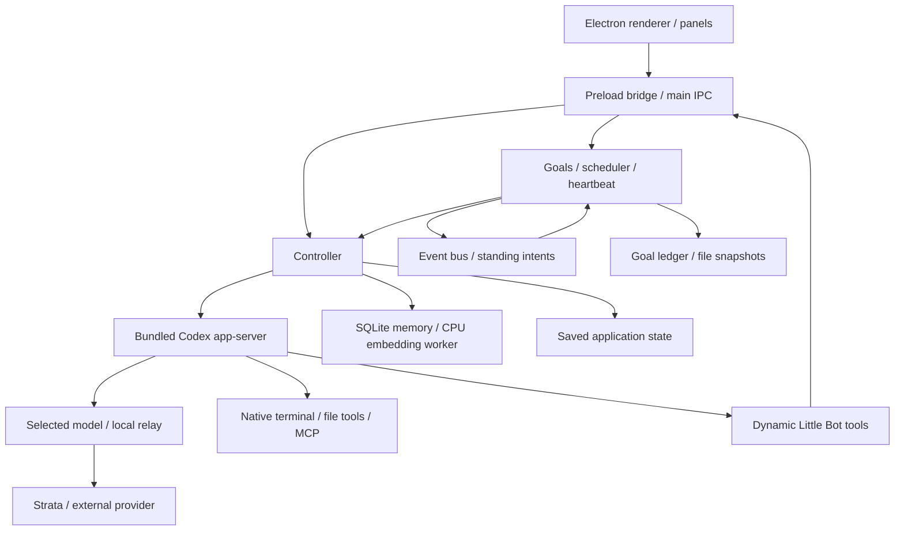

# Little Bot system guide

This folder explains the implementation of Little Bot **0.10.1**, reviewed on **2026-10-01** against application commit **c6b9c1e**. It describes current behavior, including failure conditions; design proposals in older documents are not assumed to be implemented.

Start with the [second functional review](review.md) for confirmed problems and the [source map](source-map.md) to find an implementation owner. The review includes isolated reproductions and explicitly separates model/service limits from defects.

| Piece | Guide |
| --- | --- |
| Startup, data, encryption, recovery | [Runtime and storage](01-runtime-storage.md) |
| Continuous conversation, streaming, context and compaction | [Chat and context](02-chat-context.md) |
| Connections, reasoning, local relay and Strata caches | [Models and Strata](03-models-strata.md) |
| Durable memory, search, automatic learning and CPU embeddings | [Memory](04-memory.md) |
| Tasks, ongoing reviews, budgets, coaching and chat integration | [Goals](05-goals.md) |
| Plans, evidence, verification, file snapshots and restore | [Goal ledger and files](06-goal-ledger-files.md) |
| Repeating prompts, exact schedules and missed runs | [Automations](07-automations.md) |
| Proactive checks, notification preferences and inbox | [Heartbeat and inbox](08-heartbeat-inbox.md) |
| Calendar, event routing and standing intents | [Events, intents and calendar](09-events-intents-calendar.md) |
| App management, dynamic tools and terminal execution | [Agent tools and terminal](10-agent-tools-terminal.md) |
| Visible browser, Brave search and Firecrawl | [Browser and web](11-browser-web.md) |
| Operating guide, imported skills, plugins, MCP and GitHub | [Extensions](12-skills-plugins-mcp.md) |
| Workspace, model settings and USER.md / SOUL.md | [Settings and profile](13-settings-profile.md) |
| Imports, previews, document extraction and delivered files | [Attachments](14-attachments.md) |
| User questions and answer challenges | [Questions and answer checks](15-questions-answer-checks.md) |
| Renderer, panels, stream updates and slash commands | [Interface](16-interface.md) |
| Error logs, smoke fixtures, tests, installation and packaging | [Diagnostics and distribution](17-diagnostics-distribution.md) |

Each guide gives the call path, data ownership, conditions that prevent operation, and relevant tests. The [reproduction instructions](review/README.md) explain how to repeat the new failure probes without touching personal data.

## Connections between the pieces

The public conversation is one timeline. Background memory work, heartbeat checks, goal steps and answer checks use separate engine sessions. They share one execution lane and the selected model connection; these are different concepts from separate public chats.
